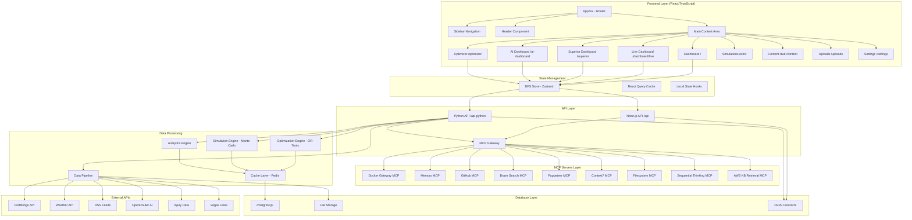
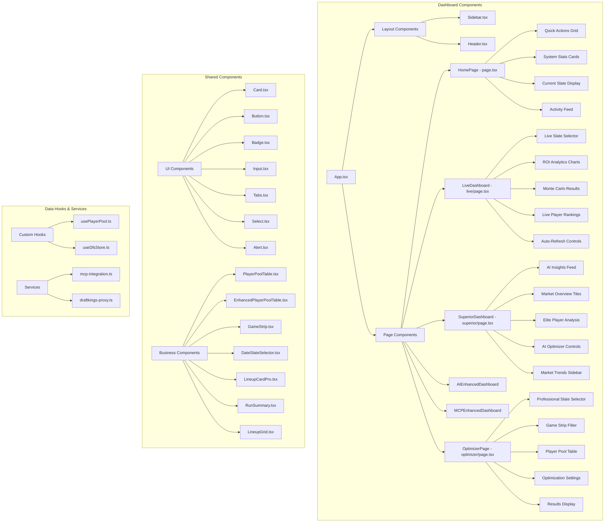
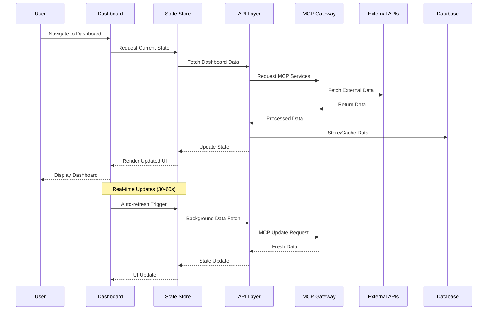

# DFS App Architecture & Dataflow Diagram

## **🏗️ SYSTEM ARCHITECTURE OVERVIEW**

## **📊 COMPONENT HIERARCHY DIAGRAM**

## **🔄 DATA FLOW ARCHITECTURE**

## **🎯 DASHBOARD ENHANCEMENT PLAN USING MCP TOOLS**

Now I'll use the available MCP servers to enhance your dashboard functionality:

### **1. Memory MCP Integration**

- **Knowledge Graph**: Store player relationships, team correlations
- **Entity Tracking**: Player performance history, injury patterns
- **Observation Management**: Market trends, ownership changes

### **2. Sequential Thinking MCP**

- **Complex Analysis**: Multi-step optimization decisions
- **Problem Solving**: Advanced portfolio management
- **Dynamic Reasoning**: Real-time strategy adjustments

### **3. Brave Search MCP**

- **News Integration**: Real-time DFS news and updates
- **Market Research**: Competitor analysis and trends
- **Content Discovery**: Expert insights and analysis

### **4. GitHub MCP**

- **Version Control**: Dashboard component updates
- **Issue Tracking**: Feature requests and bug reports
- **Deployment**: Automated dashboard releases

### **5. Context7 MCP**

- **Documentation**: Enhanced help and tutorials
- **API References**: Real-time documentation updates
- **Feature Guides**: Interactive dashboard walkthroughs

### **6. Docker Gateway MCP**

- **Container Management**: MCP server orchestration
- **Service Health**: Real-time system monitoring
- **Resource Optimization**: Performance enhancement

### **7. Puppeteer MCP**

- **Web Scraping**: Live data from competitor sites
- **Screenshot Testing**: Dashboard UI validation
- **Automated Testing**: End-to-end dashboard tests

### **8. Filesystem MCP**

- **Configuration Management**: Dynamic dashboard settings
- **Log Analysis**: System performance monitoring
- **Asset Management**: Dashboard resource optimization
